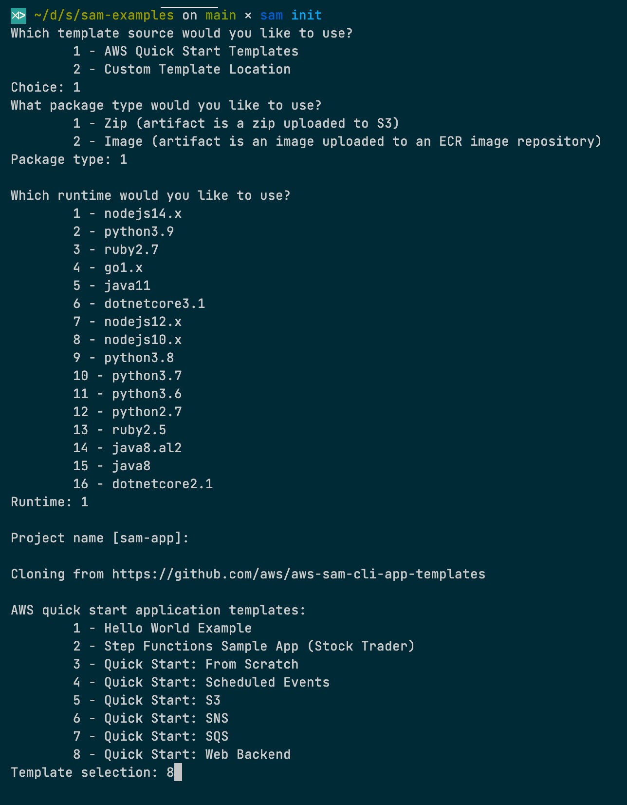
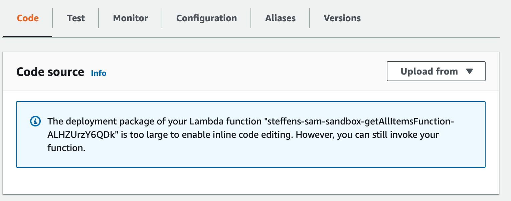
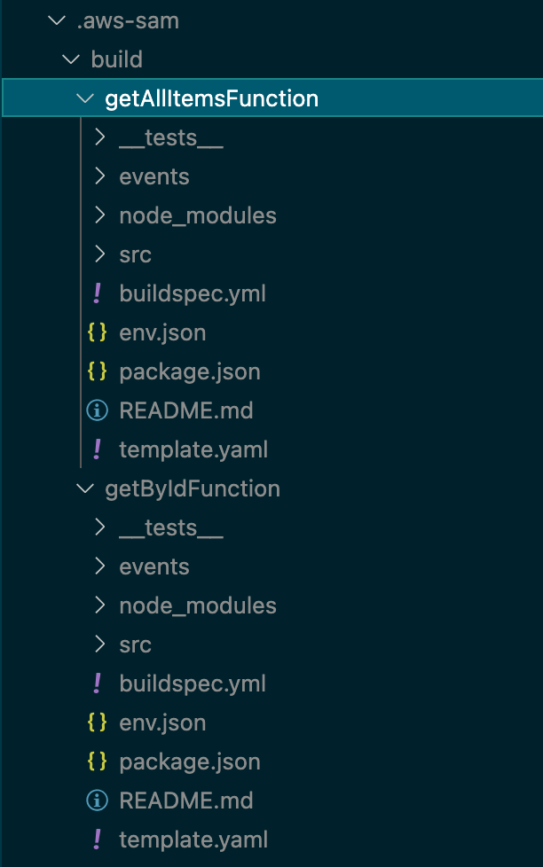
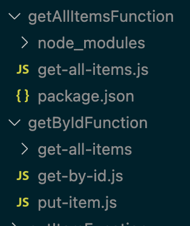
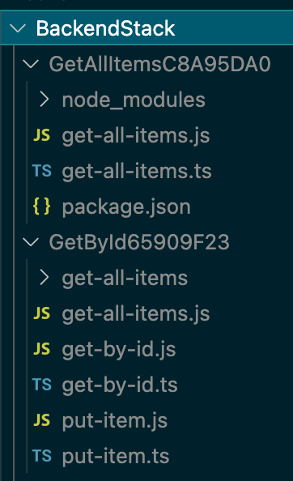
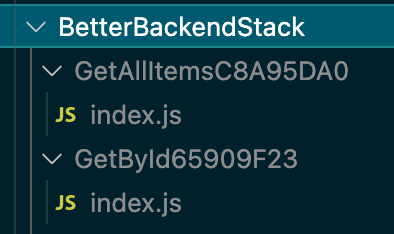

<!-- START doctoc generated TOC please keep comment here to allow auto update -->
<!-- DON'T EDIT THIS SECTION, INSTEAD RE-RUN doctoc TO UPDATE -->


- [SAM Examples](#sam-examples)
- [Default code structure with sam init](#default-code-structure-with-sam-init)
  - [Drawbacks](#drawbacks)
    - [AWS SAM does not support Typescript natively](#aws-sam-does-not-support-typescript-natively)
    - [AWS SAM in its basic setup uploads artifacts which are unnecessarily big](#aws-sam-in-its-basic-setup-uploads-artifacts-which-are-unnecessarily-big)
- [Using CodeUri and Layers](#using-codeuri-and-layers)
  - [CodeUri property](#codeuri-property)
  - [Lambda Layers](#lambda-layers)
  - [Drawbacks](#drawbacks-1)
- [SAM Beta CDK](#sam-beta-cdk)

<!-- END doctoc generated TOC please keep comment here to allow auto update -->

# SAM Examples
This repository demonstrates how you can work with [AWS Serverless Application Model (SAM)](https://docs.aws.amazon.com/serverless-application-model/index.html) and **NodeJS**.

# Default code structure with sam init
The [sam-init](./sam-init/README.md) subfolder in this repo shows how the default project structure looks like when you start your project with `sam init` of the AWS SAM CLI.



## Drawbacks
For my team and me there were some drawbacks when you start like this without tweaking your environment manually:

### AWS SAM does not support Typescript natively
AWS SAM unfortunately does not support Typescript, our language of choice, when it comes to writing NodeJS functions.
There are some open tickets in their repo which address this issue, but at the time of writing these are not resolved: 
* [Using TypeScript with nodejs runtime](https://github.com/aws/aws-sam-cli/issues/2636)
* [Enable esbuild in the Node.js builder](https://github.com/aws/aws-lambda-builders/pull/307)

### AWS SAM in its basic setup uploads artifacts which are unnecessarily big
If you build and deploy your application like this:
```
sam build
sam deploy --guided
```
you may notice the following when you inspect your deployed functions:



Whoops. What happened?
Even if the function itself does not do much or is very complex (38 SLOCs), the deployment package is too large.

By inspecting the build of SAM you can see the problem:



The whole project is included in each Lambda function, even if this is not necessary for the runtime execution of your function.

# Using CodeUri and Layers
The [sam-layers](./sam-layers/README.md) subfolder in this repo shows how the deployment package size issue can be addressed by native SAM means.

## CodeUri property

With the [CodeUri property](https://docs.aws.amazon.com/serverless-application-model/latest/developerguide/sam-resource-function.html#sam-function-codeuri) of your function in the SAM template you can specify a subfolder which contains your code of the function.

Before:
```yaml
getByIdFunction:
  Type: AWS::Serverless::Function
  Properties:
    Handler: src/handlers/get-by-id.getByIdHandler
```
After:
```yaml
getByIdFunction:
    Type: AWS::Serverless::Function
    Properties:
      CodeUri: src/handlers/
      Handler: get-by-id.getByIdHandler
```

Let's see how this affects our build output:



Now, using CodeUri, SAM just copies the contents of the specified folder. If this folder does not include a separate package.json, SAM does not install any dependencies.
`getAllItemsFunction` is contained in a separate folder which includes a package.json. As you can see from the output, for this function there is a `node_modules` folder included, which will be deployed with your function.

## Lambda Layers
On the other hand [Lambda Layers](https://docs.aws.amazon.com/serverless-application-model/latest/developerguide/building-layers.html) can be used to share dependencies between different Lambda functions. That enables you to iterate faster due to smaller deployment sizes.

In the example ['sam-layers'](./sam-layers/README.md) I created a layer for the AWS SDK.

```yaml
awsSdkLayer:
    Type: AWS::Serverless::LayerVersion
    Properties:
        LayerName: !Sub ${AWS::StackName}-AwsSdk
        Description: AwsSdk
        ContentUri: src/layers/aws-sdk
        CompatibleRuntimes:
            - nodejs14.x
        RetentionPolicy: Delete
    Metadata:
        BuildMethod: nodejs14.x
```

and referenced it in `getByIdFunction` and `putItemFunction`.

**Note** that `getAllItemsFunction` is using its own dependency definition of the `aws-sdk`. It does not use the layer.

From the Cloudwatch Logs you now can see the different versions of the `aws-sdk` being used.
```
getAllItemsFunction:    INFO	2.1039.0
putItemFunction:        INFO	2.799.0
```

## Drawbacks

Drawbacks of this solution are:
* Still no support for Typescript
* If one function references code outside of its CodeUri folder the referenced code is missing when deployed to Lambda. This will break your function.
* Managing package.json files on different levels can become messy over time

# SAM Beta CDK
There are a bunch of solutions out there trying to address these drawbacks including:
* Pre- or Post-Build processing of your files (e.g. with WebPack)
* Defining an own Build Procedure with the Makefile Builder
* Misuse Post-Install scripts to tweak the SAM Build procedure
* Replace and reengineer the SAM build procedure completely

Another solution could be to use the CDK integration of SAM which currently is available as Preview ([AWS Docs](https://docs.aws.amazon.com/serverless-application-model/latest/developerguide/serverless-cdk.html)).

Let's see what this approach can bring us: [sam-cdk](./sam-cdk/README.md).

I migrated the project from `Javascript` to `Typescript` and replaced the `template.yaml` with a CDK project.

```javascript
...
new lambda.Function(this, "GetById", {
  code: lambda.Code.fromAsset("src/handlers"),
  handler: "get-by-id.getByIdHandler",
  runtime: lambda.Runtime.NODEJS_14_X,
  layers: [
    awsSdkLayer
  ]
});
...
```
Let's see how building the project now affects our build output:
```bash
npm i
npm run build
sam-beta-cdk build --use-container -p -c
```



Hmmm. Looks a bit the same, but additionally with the `*.ts` files included.

Fortunately CDK itself can help with that:

*The NodejsFunction construct creates a Lambda function with automatic transpiling and bundling of TypeScript or Javascript code. This results in smaller Lambda packages that contain only the code and dependencies needed to run the function.
It uses **esbuild** under the hood.* - [CDK Docs](https://docs.aws.amazon.com/cdk/api/latest/docs/aws-lambda-nodejs-readme.html)

Let's try this out:

```javascript
...
new lambda_node.NodejsFunction(this, "GetById", {
  entry: "src/handlers/get-by-id.ts",
  handler: "getByIdHandler",
  runtime: lambda.Runtime.NODEJS_14_X,
  layers: [
    awsSdkLayer
  ]
});
...
```

```bash
npm i
npm run build
sam-beta-cdk build --use-container -p -c
```

Finally that is what we wanted to achieve:

